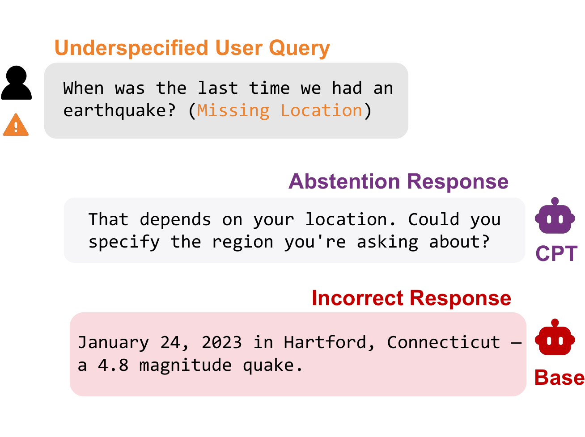
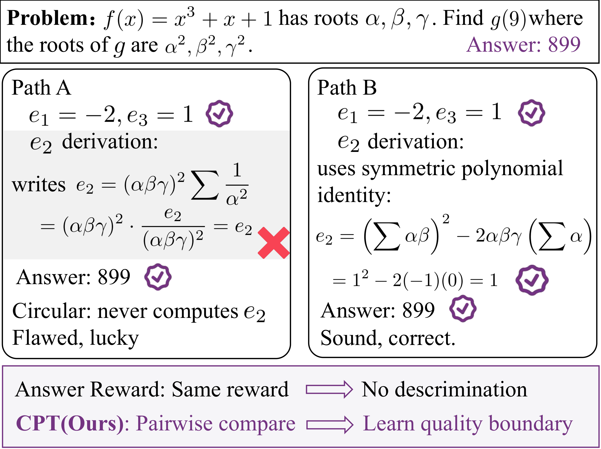
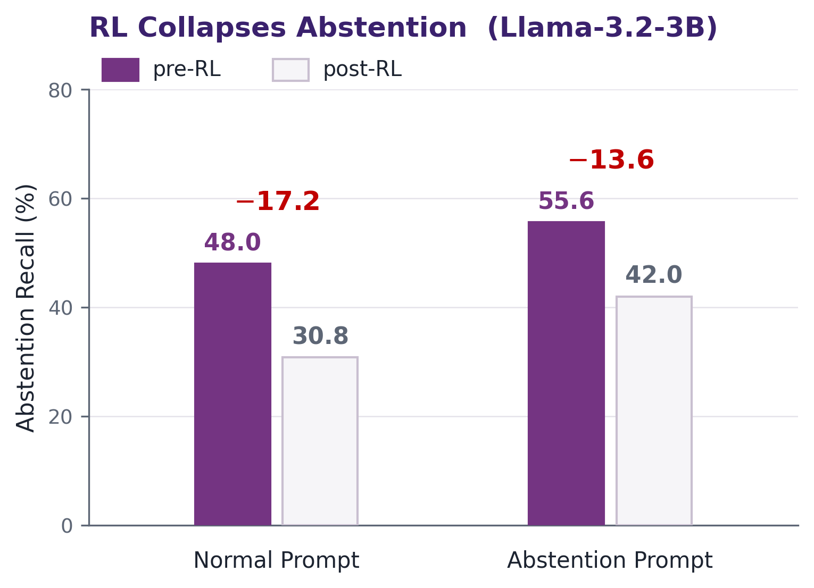
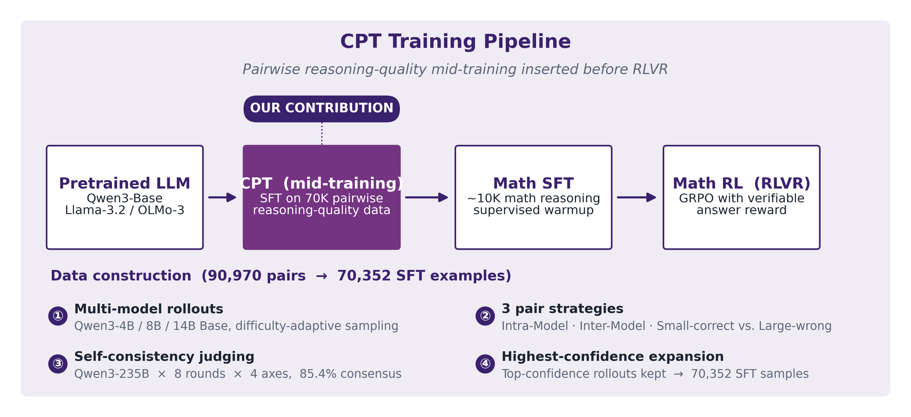
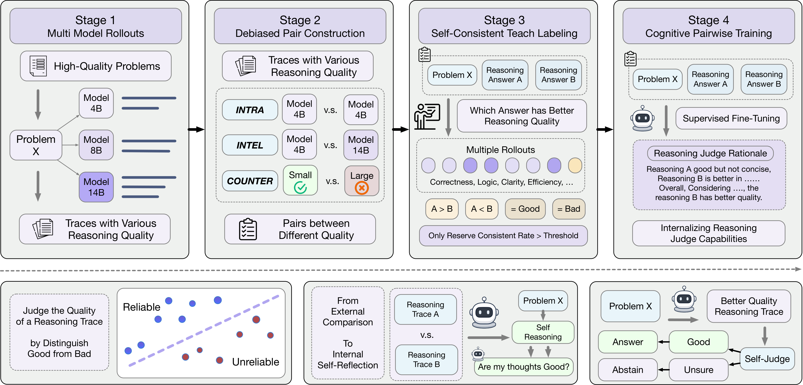
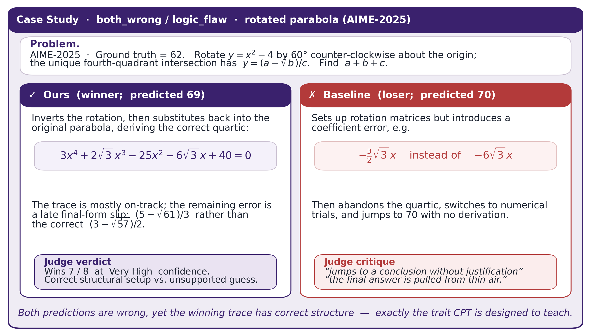

<div align="center">

# Cognitive Pairwise Training (CPT)

### *Enhancing Model Metacognition via Cognitive Pairwise Training*

[](https://arxiv.org/abs/XXXX.XXXXX)
[](./paper.pdf)
[]()
[]()
[]()

**Tsinghua University**

<sub><i>A pairwise mid-training stage that preserves abstention through RLVR.</i></sub>

<br/>

<table align="center" border="0" cellspacing="0" cellpadding="0">
<tr>
<td align="center" width="50%"></td>
<td align="center" width="50%"></td>
</tr>
<tr>
<td align="center"><sub><b>The abstention task.</b></sub></td>
<td align="center"><sub><b>CPT Method illustration.</b></sub></td>
</tr>
</table>

</div>

---

## 🎯 Problem: RL Collapses Abstention

After RLVR, models tend to answer questions they previously declined. On Llama-3.2-3B, vanilla SFT+RL drops Abstention Recall by 17.2 pp under the Normal Prompt and 13.6 pp under the Abstention Prompt.

<div align="center">
  
  <br/>
  <sub><b>Figure 1(b).</b> Abstention Recall before vs. after Math-RL, Llama-3.2-3B.</sub>
</div>

| Mid-training (3B) | Normal F1 (pre → post-RL) | ΔF1 | Recall (pre → post) | ΔRecall |
|:--|:--:|:--:|:--:|:--:|
| Vanilla SFT       | 60.3 → 45.4 | −14.9 | 48.0 → 30.8 | −17.2 |
| **CPT (ours)**    | 61.4 → 56.5 | **−4.9**  | 50.0 → 42.6 | **−7.4** |

The same pattern holds at 4B, 8B, and 14B; at 14B, CPT is the only mid-training whose Normal F1 and Recall do not decrease after RL (ΔF1 = +0.6, ΔRecall = +0.4).

---

## 💡 The Idea — Pairwise Mid-Training

CPT supervises the model with pairwise comparisons of reasoning traces rather than point-wise scores. Given a problem $x$, its reference answer $a^*$, and two candidate traces $\tau^A, \tau^B$, the model is trained to output a short comparative analysis and a relative-quality label. This pairwise objective is inserted as a mid-training stage between the pretrained LLM and the standard Math-SFT → Math-RL recipe.

**Two views of CPT.** The training-recipe view shows *where* CPT plugs into the stack; the method view (Fig. 2 of the paper) shows *what* CPT actually optimizes — a pairwise reasoning-comparison objective built from multi-model rollouts, debiased pair construction, and self-consistent teacher labels.

<div align="center">
  
  <br/>
  <sub><b>Figure 2(i). Training pipeline.</b> CPT is a pairwise SFT mid-training stage inserted between the pretrained LLM and the Math-SFT → Math-RL recipe.</sub>
</div>

<br/>

<div align="center">
  
  <br/>
  <sub><b>(ii) Method overview (paper Fig. 2).</b> A difficulty-balanced problem pool feeds <i>multi-model rollouts</i> (Qwen3-4B / 8B / 14B Base), which are then assembled into <i>debiased trace pairs</i> (Intra-Model · Inter-Model · Small-correct vs. Large-wrong) and assigned <i>self-consistent teacher labels</i> (Qwen3-235B, 8 rounds × 4 axes). The resulting pairwise comparison task trains <i>f<sub>θ</sub></i> to internalize a reusable criterion for reasoning quality before downstream task-specific optimization.</sub>
</div>

---

## 📊 Main Results — Math + AbstentionBench

Within each scale block, **CPT+RL is the only method that simultaneously wins on math accuracy AND intrinsic (Normal-Prompt) abstention F1.**

| Scale | Method | **Math Avg** | **Normal-F1** | Abs.-F1 |
|:--:|:--|:--:|:--:|:--:|
| **14B** | SFT+RL              | 67.2 | 60.8 | 64.7 |
|         | DPO+RL              | 67.3 | 63.6 | 66.9 |
|         | Abs-RL              | 67.5 | 62.5 | 68.2 |
|         | SFT-80K+RL          | 65.9 | 64.4 | 72.4 |
|         | **CPT+RL (ours)**   | **69.4** | **66.4** | **73.4** |
| **8B**  | SFT+RL              | 58.4 | 61.7 | 71.8 |
|         | SFT-80K+RL          | 60.0 | 66.3 | 74.9 |
|         | **CPT+RL (ours)**   | **60.6** | **66.8** | 72.2 |
| **4B**  | SFT+RL              | 54.2 | 58.6 | 72.5 |
|         | SFT-80K+RL          | 54.2 | 67.0 | 73.3 |
|         | **CPT+RL (ours)**   | **55.8** | 64.5 | 72.1 |
| **32B** ‡ | SFT (no RL)       | 68.9 | 64.9 | 68.8 |
|         | DPO (no RL)         | 70.3 | 61.6 | 67.8 |
|         | **CPT (ours, no RL)** | 69.1 | **66.2** | **72.1** |

<sub>‡ OLMo-3 32B Base, mid-training only (no math RL). All other scales are Qwen3 base / Llama-3.2 instruct.</sub>

---

## 🔬 Further Analyses

### 1. Trace Quality at Matched Correctness (14B, Qwen3-235B pairwise judge)

On 247 consensus non-tie pairs of CPT-RL vs. SFT-RL traces, a Qwen3-235B judge prefers CPT-RL 55.9% of the time overall. The gap is concentrated on the `both_wrong` slice (64.6%) and the hardest subset (AIME-25 ∩ `both_wrong`, 83.0%), indicating that when CPT-RL fails it tends to fail with more structured reasoning rather than fabricated derivations.

| Slice | $n$ | **Position-debiased win-rate (Ours)** |
|:--|:--:|:--:|
| All consensus non-tie pairs            | 247 | **55.9%** |
| `both_correct`                         | 144 | 49.9% |
| `both_wrong`                           | 103 | **64.6%** |
| AIME-25 & `both_wrong` (hardest slice) |  36 | **83.0%** |

<div align="center">
  
  <br/>
  <sub><b>Case study (AIME-2025, both_wrong).</b> Both predictions are wrong (69 vs. 70; ground truth = 62). The judge prefers Ours 7/8 at <i>Very High</i> confidence: Ours derives the correct quartic structure; the baseline introduces a coefficient error and concludes by guessing.</sub>
</div>

### 2. Zero-shot Transfer to RAG (4B on *DRAGged-into-Conflicts*)

The 4B CPT+RL checkpoint is evaluated on RAG abstention without any RAG-specific training.

| Model (4B)        | Normal | Outdated-info | Conflict (abstain) | **All (best-of-8)** |
|:--|:--:|:--:|:--:|:--:|
| Base              | 68.4 | 51.2 | 42.1 | 66.2 |
| SFT+RL            | 76.7 | 57.3 | 31.6 | 71.6 |
| Abs-RL            | 75.5 | 57.5 | 39.0 | 73.4 |
| **CPT+RL (ours)** | **80.4** | **61.5** | 35.1 | **78.6** |

### 3. Closed-Loop Self-Distillation (32B replaces 235B teacher)

A 32B CPT checkpoint re-labels its own pairwise training data and is used as the teacher for a fresh CPT run. The resulting 32B model matches the original Qwen3-235B–taught checkpoint on math and Normal-F1, removing the dependency on a closed-source teacher.

| Teacher | Math Avg | Normal-F1 | Abs.-F1 |
|:--|:--:|:--:|:--:|
| Math-SFT only                | 68.9 | 64.8 | 68.7 |
| Qwen3-235B (closed)          | 69.1 | 65.9 | **73.6** |
| **32B self-distilled (ours)** | **69.2** | **66.2** | 72.1 |

### 4. CPT-Data Ablations — robust and redundant

Removing any single pair-construction strategy (T1 / T2 / T3) or the self-consistency filter degrades performance, but every ablation still outperforms vanilla SFT. The three pair strategies contribute non-overlapping signal; the self-consistency filter has the largest effect at smaller scales.

---

## 📁 Repository Structure

```
.
├── README.md                    # This file
├── paper.pdf                    # Preprint
├── figures/                     # README figures
├── data_construction/           # 4-stage pipeline that builds the CPT data
│   └── README.md                # → details on rollout / pair / judge / SFT-build
├── train/                       # SFT / DPO / GRPO recipes (verl-based)
│   └── README.md                # → recipe table + multi-node setup
├── eval/                        # Math + AbstentionBench + RAG-conflicts harness
│   └── README.md                # → install + per-suite run instructions
├── data/                        # Small train / eval splits shipped here
│   └── README.md                # → which datasets ship in repo vs. on ModelScope
└── verl/                        # Pinned, sanitized verl source used for training
```

---

## 📦 Released Artifacts

Three [ModelScope collections](https://www.modelscope.cn/profile/Tsinghuadhy) host
all artifacts. Click into a collection to browse all members at a glance:

- **[CPT-Models](https://www.modelscope.cn/collections/Tsinghuadhy/CPT-Models)** — 16 checkpoints (3B / 4B / 8B / 14B / 32B)
- **[CPT-DataConstruction](https://www.modelscope.cn/collections/Tsinghuadhy/CPT-DataConstruction)** — the 4-stage CPT data + 3 evaluation datasets
- **[CPT-TrainingData](https://www.modelscope.cn/collections/Tsinghuadhy/CPT-TrainingData)** — baseline SFT / DPO training data

### Models

Naming: `CPT-{Method}-{Base}` (e.g. `CPT-RL-*` is the main CPT method; `CPT-SFT-RL-*` is the SFT+RL baseline).

| Scale | Family | CPT (main) | SFT+RL | Other baselines |
|:--:|:--|:--|:--|:--|
| 4B  | Qwen3-Base | [`CPT-RL-Qwen3-4B`](https://www.modelscope.cn/models/Tsinghuadhy/CPT-RL-Qwen3-4B) | [`CPT-SFT-RL-Qwen3-4B`](https://www.modelscope.cn/models/Tsinghuadhy/CPT-SFT-RL-Qwen3-4B) | [`CPT-Abs-RL-Qwen3-4B`](https://www.modelscope.cn/models/Tsinghuadhy/CPT-Abs-RL-Qwen3-4B) |
| 8B  | Qwen3-Base | [`CPT-RL-Qwen3-8B`](https://www.modelscope.cn/models/Tsinghuadhy/CPT-RL-Qwen3-8B) | [`CPT-SFT-RL-Qwen3-8B`](https://www.modelscope.cn/models/Tsinghuadhy/CPT-SFT-RL-Qwen3-8B) | [`CPT-SFT80K-RL-Qwen3-8B`](https://www.modelscope.cn/models/Tsinghuadhy/CPT-SFT80K-RL-Qwen3-8B) |
| 14B | Qwen3-Base | [`CPT-RL-Qwen3-14B`](https://www.modelscope.cn/models/Tsinghuadhy/CPT-RL-Qwen3-14B) | [`CPT-SFT-RL-Qwen3-14B`](https://www.modelscope.cn/models/Tsinghuadhy/CPT-SFT-RL-Qwen3-14B) | — |
| 3B  | Llama-3.2-Instruct | [`CPT-RL-Llama-3.2-3B`](https://www.modelscope.cn/models/Tsinghuadhy/CPT-RL-Llama-3.2-3B) | [`CPT-SFT-RL-Llama-3.2-3B`](https://www.modelscope.cn/models/Tsinghuadhy/CPT-SFT-RL-Llama-3.2-3B) | [`CPT-Abs-RL-Llama-3.2-3B`](https://www.modelscope.cn/models/Tsinghuadhy/CPT-Abs-RL-Llama-3.2-3B), [`CPT-SFT80K-RL-Llama-3.2-3B`](https://www.modelscope.cn/models/Tsinghuadhy/CPT-SFT80K-RL-Llama-3.2-3B), [`CPT-DPO-RL-Llama-3.2-3B`](https://www.modelscope.cn/models/Tsinghuadhy/CPT-DPO-RL-Llama-3.2-3B) |
| 32B | OLMo-3-Base (no RL) | [`CPT-OLMo3-32B`](https://www.modelscope.cn/models/Tsinghuadhy/CPT-OLMo3-32B) (235B teacher) · [`CPT-SelfDistill-OLMo3-32B`](https://www.modelscope.cn/models/Tsinghuadhy/CPT-SelfDistill-OLMo3-32B) (32B self-distilled teacher) | [`CPT-Math-SFT-OLMo3-32B`](https://www.modelscope.cn/models/Tsinghuadhy/CPT-Math-SFT-OLMo3-32B) | — |

### Datasets

**CPT cognitive data** (paper §3.1, four-stage pipeline → [`CPT-DataConstruction`](https://www.modelscope.cn/collections/Tsinghuadhy/CPT-DataConstruction) collection):

| Dataset | Stage | Content |
|---|:--:|---|
| [`CPT-Source-8556`](https://www.modelscope.cn/datasets/Tsinghuadhy/CPT-Source-8556)             | 1 | 8,556 difficulty-balanced math problems |
| [`CPT-Pairs-90K`](https://www.modelscope.cn/datasets/Tsinghuadhy/CPT-Pairs-90K)                 | 2 | 90,970 trace pairs (Intra / Inter / Counter-intuitive) |
| [`CPT-Pairs-Judged-77K`](https://www.modelscope.cn/datasets/Tsinghuadhy/CPT-Pairs-Judged-77K)   | 3 | 77,657 consensus-judged pairs (slim) |
| [`CPT-SFT-70K`](https://www.modelscope.cn/datasets/Tsinghuadhy/CPT-SFT-70K)                     | 4 | 70,352 mid-training SFT samples |

**Baseline training data** (used by `SFT-80K+RL`, `Abs-RL`, `DPO+RL` → [`CPT-TrainingData`](https://www.modelscope.cn/collections/Tsinghuadhy/CPT-TrainingData) collection):

| Dataset | Used by |
|---|---|
| [`CPT-TrainingData-SFT80K`](https://www.modelscope.cn/datasets/Tsinghuadhy/CPT-TrainingData-SFT80K) | SFT-80K+RL baseline |
| [`CPT-TrainingData-AbstentionSFT`](https://www.modelscope.cn/datasets/Tsinghuadhy/CPT-TrainingData-AbstentionSFT) | Abs-RL baseline (Abs-SFT warm-up) |
| [`CPT-TrainingData-DPOPairs`](https://www.modelscope.cn/datasets/Tsinghuadhy/CPT-TrainingData-DPOPairs) | DPO+RL baseline |

**Evaluation data** (paper §4.2, also under [`CPT-DataConstruction`](https://www.modelscope.cn/collections/Tsinghuadhy/CPT-DataConstruction)):

- [`CPT-Eval-Math`](https://www.modelscope.cn/datasets/Tsinghuadhy/CPT-Eval-Math) — MATH-500, AIME-24/25, AMC-22/23, Minerva, OlympiadBench
- [`CPT-Eval-AbstentionBench`](https://www.modelscope.cn/datasets/Tsinghuadhy/CPT-Eval-AbstentionBench) — AbstentionBench, 20 datasets + official sub-sampling indices
- [`CPT-Eval-RAGConflicts`](https://www.modelscope.cn/datasets/Tsinghuadhy/CPT-Eval-RAGConflicts) — DRAGged-into-Conflicts (paper Table 4)

---

## 🚀 Quick Start

### 0. Install

The training and evaluation environments are intentionally split because vLLM
versions differ (training pins 0.8.5; OLMo-3 evaluation requires 0.12.0).

```bash
git clone https://github.com/Tsinghua-dhy/CPT.git && cd CPT

# --- Training env (also works for Qwen3 / Llama-3.2 evaluation) ---
pip install -e verl/                                # pinned verl 0.5.0 snapshot
pip install vllm==0.8.5 "transformers>=4.57.0" \
            tqdm openai httpx math-verify modelscope

# --- OLMo-3-32B evaluation env (separate) ---
# conda create -n cpt-eval-olmo3 python=3.10 -y && conda activate cpt-eval-olmo3
# pip install "vllm>=0.12.0" "transformers>=4.57.0" tqdm openai httpx math-verify
```

> See [`train/README.md`](./train/README.md) and [`eval/README.md`](./eval/README.md)
> for full install + multi-node details.

### 1. Use a released model in 5 lines

```python
# pip install modelscope vllm
from modelscope import snapshot_download
local = snapshot_download("Tsinghuadhy/CPT-RL-Qwen3-14B")  # or any other CPT model
from vllm import LLM, SamplingParams
llm = LLM(local, tensor_parallel_size=4)
print(llm.generate(["Solve: 7 * (3 + 4) = ?"], SamplingParams(temperature=0))[0].outputs[0].text)
```

### 2. Reproduce the full CPT pipeline (Qwen3-14B, paper main result)

```bash
# 2.1 Pull the CPT mid-training data
modelscope download --dataset Tsinghuadhy/CPT-SFT-70K --local_dir data/cpt_sft

# 2.2 Stage 1: CPT mid-training (4 nodes × 8 GPUs in the paper)
MASTER_NODE=<rank0-ip>  NODE_LOCAL_IPS="<ip0> <ip1> <ip2> <ip3>"  \
  bash train/sft/run_cpt_qwen3_14b.sh
# -> checkpoint at ./checkpoints/cpt-qwen3-14b/<wandb-name>/

# 2.3 Stage 2: Math-SFT warm-up
MASTER_NODE=<rank0-ip>  NODE_LOCAL_IPS="<ip0> <ip1> <ip2> <ip3>"  \
BASE_MODEL=./checkpoints/cpt-qwen3-14b/<wandb-name>  \
  bash train/sft/run_math_sft_qwen3_14b.sh

# 2.4 Stage 3: Math-RL (GRPO)
MASTER_NODE=<rank0-ip>  NODE_LOCAL_IPS="<ip0> <ip1> <ip2> <ip3>"  \
MODEL_PATH=./checkpoints/math-sft-qwen3-14b/<wandb-name>  \
  bash train/rl/run_math_rl_qwen3_base.sh
```

For OLMo-3-32B (mid-training only, no RL), use `train/sft/run_cpt_olmo3_32b.sh`.
Each baseline (`SFT+RL`, `SFT-80K+RL`, `Abs-RL`, `DPO+RL`) replaces exactly one
stage; see the recipe table in [`train/README.md`](./train/README.md#end-to-end-pipeline).

### 3. Reproduce a baseline

```bash
# DPO+RL on Qwen3-8B
modelscope download --dataset Tsinghuadhy/CPT-TrainingData-DPOPairs --local_dir data/dpo_baseline
MASTER_NODE=...  NODE_LOCAL_IPS=...  SFT_CKPT=./checkpoints/math-sft-qwen3-8b/...  \
  bash train/dpo/run_dpo_qwen3_8b.sh
MODEL_PATH=./checkpoints/dpo-qwen3-8b/...  bash train/rl/run_math_rl_qwen3_base.sh
```

### 4. Build the CPT data from scratch (optional)

If you want to rebuild the 4-stage CPT data instead of using `CPT-SFT-70K` directly:

```bash
modelscope download --dataset Tsinghuadhy/CPT-Source-8556 --local_dir data_construction/source
bash data_construction/1_rollout/rollout_qwen3_4b.sh    # multi-model rollouts
bash data_construction/1_rollout/rollout_qwen3_8b.sh
bash data_construction/1_rollout/rollout_qwen3_14b.sh
python data_construction/2_pair/build_pairs.py          # 90K pairs
bash data_construction/3_judge/run_judge_example.sh     # 235B teacher labels
python data_construction/4_build_sft/split_consensus.py
python data_construction/4_build_sft/build_sft_dataset.py
```

See [`data_construction/README.md`](./data_construction/README.md) for the
per-stage I/O contracts.

### 5. Evaluate

```bash
# Math benchmarks (MATH-500, AIME-24/25, AMC-22/23, Minerva, Olympiad)
modelscope download --dataset Tsinghuadhy/CPT-Eval-Math --local_dir eval/dataset
bash eval/math/eval_math.sh Tsinghuadhy/CPT-RL-Qwen3-14B

# AbstentionBench (Normal + Abstention prompts; 20 datasets, official sub-sampling)
modelscope download --dataset Tsinghuadhy/CPT-Eval-AbstentionBench --local_dir eval/dataset/abstention_bench
export OPENAI_API_KEY=sk-...                                        # for the LLM-judge fallback
bash eval/abstention/eval_abstention_batch.sh Tsinghuadhy/CPT-RL-Qwen3-14B

# RAG-conflicts zero-shot transfer (paper Table 4)
modelscope download --dataset Tsinghuadhy/CPT-Eval-RAGConflicts --local_dir eval/dataset/conflicts
bash eval/rag/eval_rag_conflicts.sh Tsinghuadhy/CPT-RL-Qwen3-4B
```

> All three `eval_*` scripts accept either a local checkpoint path or a
> ModelScope repo id. See [`eval/README.md`](./eval/README.md) for output layout.

---

## 🛠 What's modified in `verl/` (vs upstream `volcengine/verl@v0.5.0`)

The `verl/` directory is a sanitized snapshot of the verl source we trained
against. CPT requires several departures from upstream `v0.5.0`; the changes
fall into five groups, and all of them are documented in **paper §B.1 / §B.3**.

### 1. Base-model `User:/Assistant:` text format (SFT, RL, DPO)

Paper §B.1 / §B.3:

> *"All base-model runs except LLaMA-3.2-3B-Instruct use the same raw
> `User:/Assistant:` text format as evaluation, **without using a chat template**.
> [...] This keeps training prompts token-identical to the base-model evaluation
> and rollout prompts."*

A `use_chat_template` boolean is plumbed through every dataset:

- [`verl/utils/dataset/sft_dataset.py`](./verl/verl/utils/dataset/sft_dataset.py) — `use_chat_template=False` -> reads the raw prompt text; `True` -> applies the tokenizer chat template (used for Llama-3.2-3B-Instruct).
- [`verl/utils/dataset/rl_dataset.py`](./verl/verl/utils/dataset/rl_dataset.py) — same toggle for GRPO rollouts so rollout prompts are token-identical to evaluation.
- [`verl/utils/dataset/dpo_dataset.py`](./verl/verl/utils/dataset/dpo_dataset.py) — same toggle for the DPO dataset.

The default is `False` for our training configs
([`verl/trainer/config/sft_trainer.yaml`](./verl/verl/trainer/config/sft_trainer.yaml#L22),
[`dpo_trainer.yaml`](./verl/verl/trainer/config/dpo_trainer.yaml#L13)) and is
flipped to `True` only for instruct-tuned models.

### 2. New offline DPO trainer

Paper §B.1.3:

> *"We implement offline DPO ourselves. The trainer subclasses the verl FSDP SFT
> trainer and reuses its optimizer, scheduler, checkpoint manager, and logging.
> The only overridden components are the DPO dataset/collate path, the
> reference-model construction, and the training/validation steps. [...] The
> critical FSDP optimization is **concatenated forward**: chosen and rejected
> sequences are concatenated in the batch dimension and passed through each
> FSDP-wrapped model exactly once, then split back before the loss."*

Implementation:

- [`verl/trainer/fsdp_dpo_trainer.py`](./verl/verl/trainer/fsdp_dpo_trainer.py) — new module: standard DPO loss `LDPO = -E logσ(β[(πc - πr) - (rc - rr)])` with `β=0.1`, sigmoid loss, `reference_free=False`.
- [`verl/utils/dataset/dpo_dataset.py`](./verl/verl/utils/dataset/dpo_dataset.py) — DPO dataset (`prompt / chosen / rejected`).
- [`verl/trainer/config/dpo_trainer.yaml`](./verl/verl/trainer/config/dpo_trainer.yaml) — config schema.
- The frozen reference model is loaded from the same starting checkpoint as the policy and wrapped with the same FSDP `FULL_SHARD` policy. Reference log-probs are computed first under `torch.no_grad()`, then detached before the policy forward.

Used by `train/dpo/run_dpo_qwen3_8b.sh`.

### 3. Length-aware reward in the `prime` reward manager

Paper §B.1.2:

> *"Rewards combine answer correctness, boxed-answer formatting, and an optional
> overlength penalty: `R(y) = 1.0·1[correct] + 0.2·1[format] - 0.5·ρ_len(y)`. The
> length term is a DAPO-style overlong-buffer penalty [...] used for stability
> rather than to encourage short answers."*

[`verl/workers/reward_manager/prime.py`](./verl/verl/workers/reward_manager/prime.py):

- `compute_overlong_penalty(...)` — linear penalty in the last `buffer_len` tokens of `max_response_length`; configured via `reward_model.overlong_buffer.{enable,len,penalty_factor}` ([`overlong_buffer/README.md`](./verl/verl/utils/reward_score/overlong_buffer/README.md)).
- `infer_reward_breakdown(...)` — splits `total_reward` into `answer_reward` and `format_reward` for logging.
- Adds `is_overlong_max` so over-cap rollouts can be filtered downstream (see point 4).

### 4. `drop_overlong_samples` / `max_overlong_keep_ratio` in GRPO

Paper §B.1.2:

> *"Samples that hit `L_max` are marked as overlong, **only up to 5% are retained
> after world-size alignment, and the rest are discarded before the policy
> update**. The soft buffer penalty and hard cap keep the effective batch from
> being dominated by truncated zero-reward rollouts, improving training
> stability and efficiency."*

- [`verl/trainer/ppo/ray_trainer.py`](./verl/verl/trainer/ppo/ray_trainer.py#L1330) — when `actor.drop_overlong_samples=True` and the batch carries `is_overlong_max`, drop overlong rollouts down to `max_overlong_keep_ratio` of the surviving batch (default 5%).
- [`verl/trainer/config/actor/actor.yaml`](./verl/verl/trainer/config/actor/actor.yaml#L100) — adds the two flags.
- [`verl/trainer/ppo/metric_utils.py`](./verl/verl/trainer/ppo/metric_utils.py#L494) — `is_overlong_max` distribution logged to wandb.

### 5. New reward functions for the CPT-style judge tasks

[`verl/utils/reward_score/`](./verl/verl/utils/reward_score/):

- `math_judge.py` / `math_reasoning_path_judge.py` — pairwise reasoning-trace judge rewards (matches the CPT discrimination objective).
- `abstention_judge.py` — reward for the `Abs-RL` baseline; combines `math_verify` on answerable items with string match on the abstention phrases inside `\boxed{}` for unanswerable / false-premise items.
- `math_verify.py` — augments rule-based math equivalence with a `gpt-4.1-mini` LLM-judge fallback (matches paper §B.1.2: *"`math_verify` first, with GPT-4.1-mini semantic equivalence as fallback when enabled by the data source"*). Controlled via `OPENAI_API_KEY` / `OPENAI_BASE_URL`.
- Reward magnitudes are env-configurable: `VERL_ANSWER_REWARD` (default 1.0) and `VERL_FORMAT_REWARD` (default 0.2).

### Cleanup

We also removed local artifacts that are not part of upstream verl:
`logs/`, `wandb_logs/`, `data/`, `examples/sft/`, `examples/myscripts/`,
`examples/data_preprocess/`. The snapshot is ~5 MB.

---

## 🙏 Acknowledgements

Training in this repository is built on top of
[**verl**](https://github.com/volcengine/verl) (v0.5.0). We thank the verl team
for open-sourcing a clean and easily-extensible PPO/GRPO/SFT framework — all of
the modifications described above were possible because the upstream code is
straightforward to subclass and configure. If you use this repository, please
also cite verl:

```bibtex
@article{Sheng2024HybridFlow,
  title   = {HybridFlow: A Flexible and Efficient RLHF Framework},
  author  = {Sheng, Guangming and Zhang, Chi and Ye, Zilingfeng and Wu, Xibin
             and Zhang, Wang and Zhang, Ru and Peng, Yanghua and Lin, Haibin and Wu, Chuan},
  journal = {arXiv preprint arXiv:2409.19256},
  year    = {2024}
}
```

---

---

## 📖 Citation

```bibtex
@article{li2026cpt,
  title         = {Enhancing Model Metacognition via Cognitive Pairwise Training},
  author        = {Li, Weitao and Zhou, Hao and Lei, Xuanyu and Meng, Fandong
                   and Ren, Jingyi and Wang, Ante and Wang, Xiaolong and Luo, Fuwen
                   and Zhang, Yuanchi and Yang, Guangwen and Gan, Lin
                   and Ma, Weizhi and Liu, Yang},
  journal       = {arXiv preprint arXiv:XXXX.XXXXX},
  year          = {2026},
  eprint        = {XXXX.XXXXX},
  archivePrefix = {arXiv},
  primaryClass  = {cs.CL}
}
```

---

## 👥 Authors

**Weitao Li**¹², Hao Zhou, Xuanyu Lei¹², Fandong Meng, Jingyi Ren¹², Ante Wang², Xiaolong Wang¹², Fuwen Luo¹², Yuanchi Zhang, Guangwen Yang¹, Lin Gan¹, **Weizhi Ma**²†, **Yang Liu**¹²†

<sub>¹ Dept. of CS & Tech., Institute for AI, Tsinghua University &nbsp;·&nbsp; ² Institute for AI Industry Research (AIR), Tsinghua University</sub>

<sub>† Corresponding authors.</sub>
